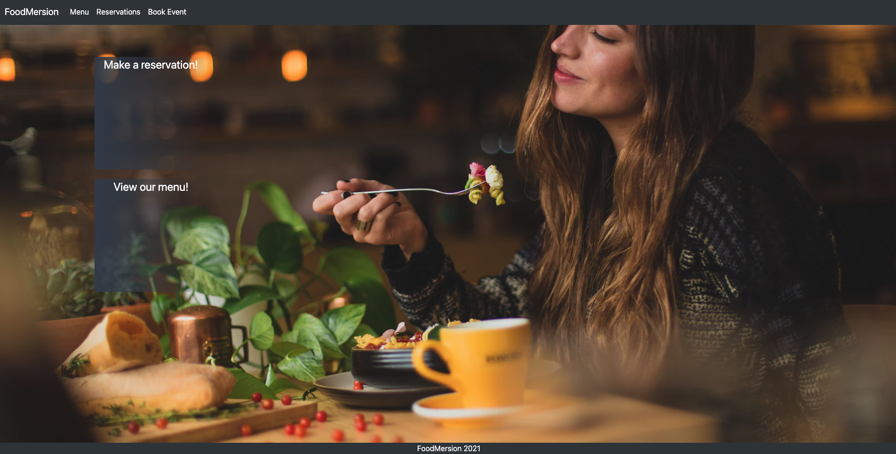
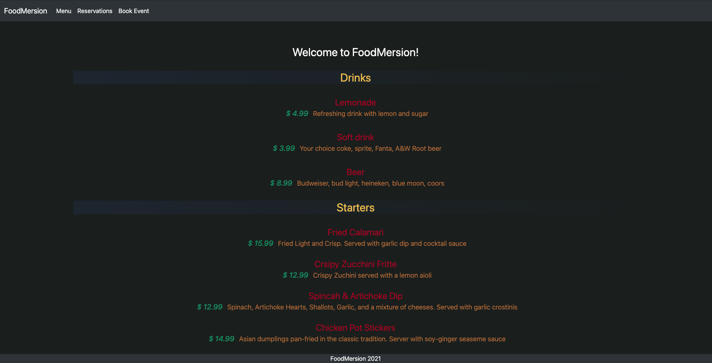
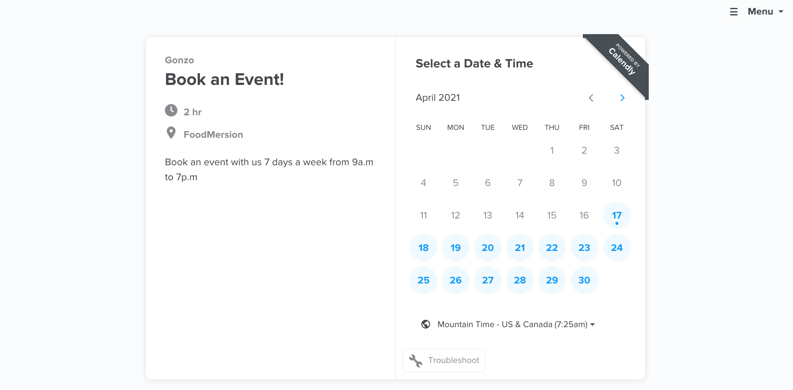

# FoodMersion-

  ## User Story
  * as a user when I want to eat something and would like a rotating suprise menu then I go to foodmersions website
  * When arriving to the homepage I am then presented with a mobile responsive website that has a polished interface
  * when I click on one of the two buttons, or the navbar links, I am taken to the specified page
  * when I fill out my reservation form and submit, I am notified. 
  * when I view my reservation, I am able to sign up or login.
  * when I want to vote on a dish or recommend my own, I am presented with an option to do so
  * when I wish to book an event, I am able to schedule my day and time. 

  ## Table of contents
  - [Technologies Used](#technologies-Used)
  - [Resources](#resources)
  - [User Story](#user-Story)
  - [Description](#description)
  - [Installation](#installation)
  - [Usage](#usage)
  - [License](#license)
  - [Contributors](#contributors)
  - [Tests](#tests)
  - [Questions](#questions)
  - [Future Development](#future-Development)
  - [Deployed Application](#Deployed-Application)

  ## Description
  FullStack website for our imaginary restaurant FoodMersion - an interactive dining experience. 

  ## Installation
  * no installation required, simply go to the deployed site on heroku.
  * if you would like to test the app you can fork our repository
  * create a database in MySQL workbench called menu_db 
  * open your terminal or bash and navigate to the repository you forked
  * change the login information in the .env file to match your MySQL credentials 
  * npm install
  * npm run seed
  * npm run start
  * open a browser and type in localhost:3001

  ## Usage
  * Click on the link for the website
  * When presented with the homepage, you may click either view our menu or make a reservation. You also have the option of using the navbar at the top of the screen
  * when you click make a reservation please fill out the page accordingly
  * when finished filling out all available fields, please hit submit.
  * you may click the "view reservations" button on to view and edit your reservation
  * to book an event you may click on the "book event" tab in the navbar and will be directed to our Calendly page.
  * feel free to test the routes after submitting a reservation using insomnia or postman. Get route http://localhost:3001/api/reservations

  ## Future Development
  * Allow customers to recommend dishes as well as vote on dishes they would like to see added to the menu
  * Create a handlebars view page for the book event page as well as routes to handle the page 
  * include authorization and password encryption on our login/signup page
  * Create a handlbars page, routes, and table within our database to handle all recommended and voted on dishes

  ## Technologies Used
  * Handlebars.js
  * Javascript
  * CSS 
  * Node.JS
  * MySQL 
  * npm packages installed - bcrypt, donnect-session-sequelize, dotenv, express, express-handlebars, express-session, mysql2, nodemon, and sequelize

  ## License
  

  The license covering this application is the MIT license.

  ## Contributors
  * Of course I am a contributor - you can find my contact info at the bottom of the page.
  * [Jackson Curdo](https://github.com/jacksoncurdo) on Github 
  * [Kari Johnson](https://github.com/Karijayyy) on Github
  * [William Pollak](https://github.com/trae77) on Github

  ## Resources
* [Installing jaws](https://devcenter.heroku.com/articles/jawsdb)
* [Deploying Node Apps](https://devcenter.heroku.com/articles/deploying-nodejs)
* [Wireframe for our rough UI/UX](https://wireframe.cc/tP7JbN)
* [CSS Library TailwindCSS](https://tailwindcss.com/docs)
* [Styling forms with tailwinds](https://css-tricks.com/style-form-tailwind-css/)
* [Background picture scaling](https://css-tricks.com/)perfect-full-page-background-image/)
* [Background images](https://unsplash.com/)
  

  ## Deployed Application
[You can visit our site on heroku](https://evening-spire-50554.herokuapp.com/)

  ## Tests
  This application was tested by the developers

  ## Questions
  Find me on Github or reach out via email

  You can find me on GitHub at [iigonzoii](https://github.com/iigonzoii)

  Email me if you run into any questions at a.gonzalez418@gmail.com
 
 
 <a href="https://drive.google.com/file/d/1PtvgUG9kvXFnMEaekvSjFSfgDrUur8qf/view?usp=sharing" target="_blank">heres a walkthrough of the application if you need further review!</a>
 